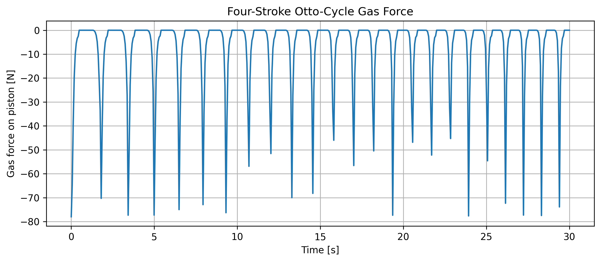
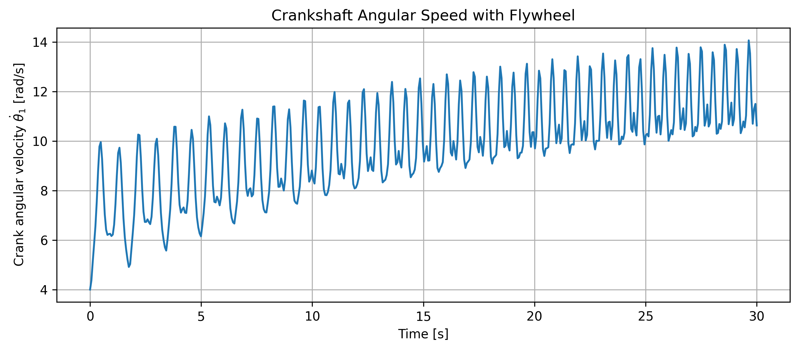
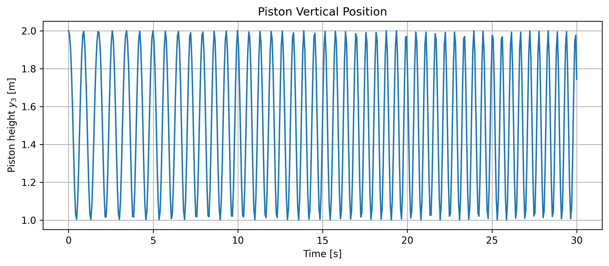
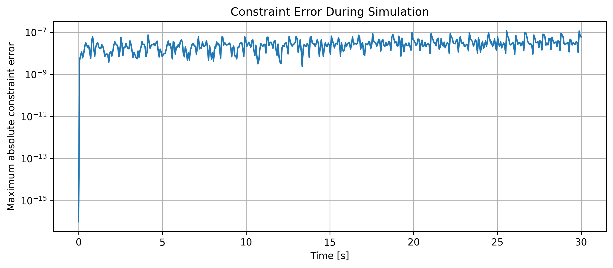

# amme2500-piston-sim
piston simulation with 4 stroke otto cycle and flywheel. 
TO INSTALL IN TERMINAL:
git clone https://github.com/tzhe0700/amme2500-piston-sim.git \\
code.

<p align="center">
  
</p>

# Four-Stroke Otto Cycle Piston Engine Simulation

A constrained multibody dynamics simulation of a slider-crank piston engine with:

- Four-stroke Otto-cycle gas force input
- Flywheel rotational inertia
- Lagrange multiplier constraint forces
- Baumgarte constraint stabilisation
- Animated crank, connecting rod and piston motion


## Simulation Results

### Otto-Cycle Gas Force

The gas force shows the high-force power stroke followed by exhaust, intake and compression strokes.

<p align="center">
  
</p>

### Crankshaft Speed with Flywheel

The flywheel stores rotational energy and reduces angular-speed variation during the non-power strokes.

<p align="center">
  
</p>

### Piston Motion

<p align="center">
  
</p>

### Constraint Accuracy

<p align="center">
  
</p>

## How to Run

Install the dependencies:

```bash
pip install numpy sympy scipy matplotlib
